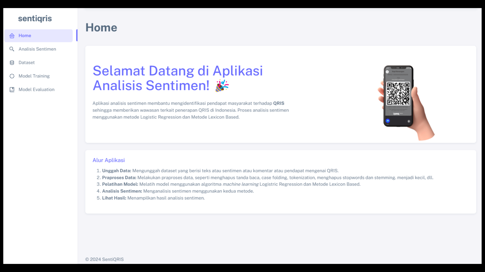
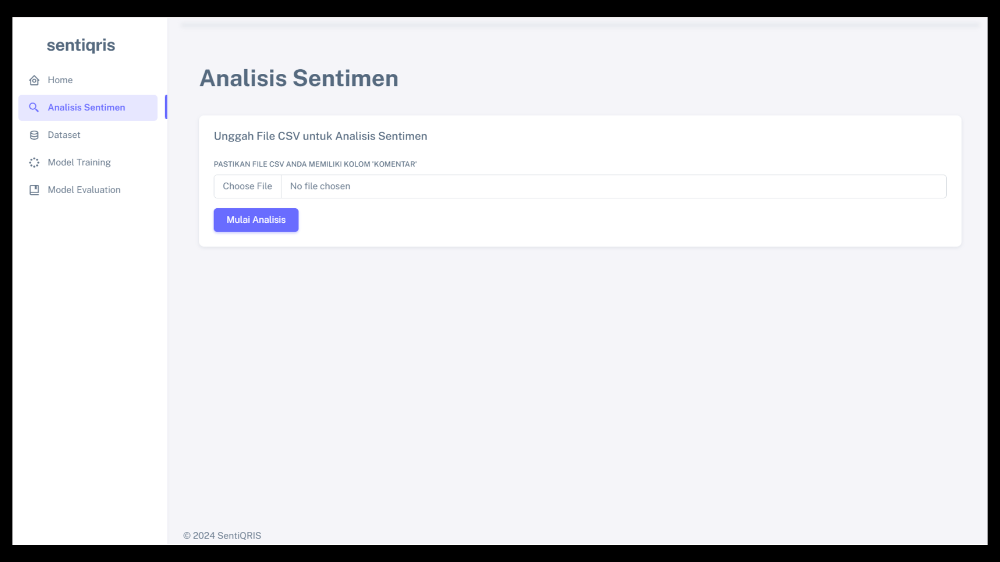
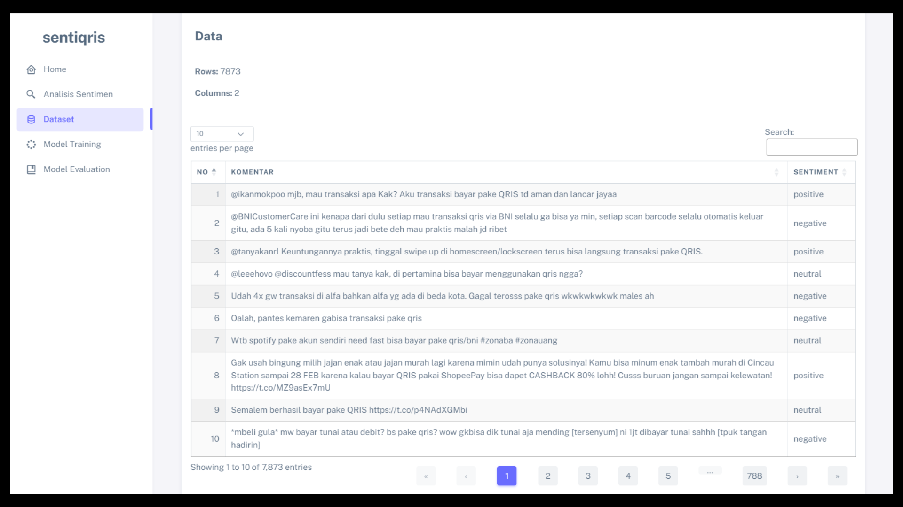
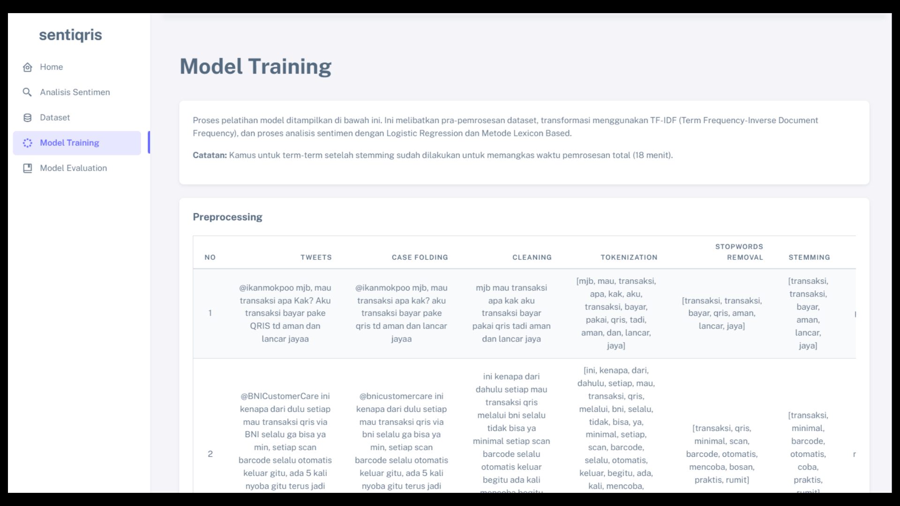
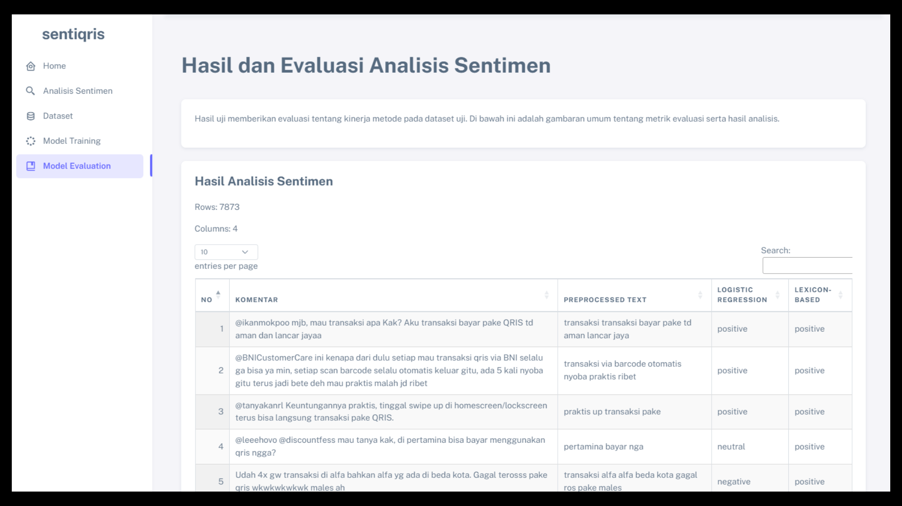

# Sentiment Analysis Application for QRIS

## Overview
This Flask-based web application performs sentiment analysis on public opinions about QRIS (Quick Response Code Indonesian Standard). The analysis results are presented through the website, showing sentiment analysis results from CSV files containing comments/opinions about QRIS, sentiment percentages in pie charts, and word clouds for each sentiment category.

## Project Structure

### Notebooks
Contains Jupyter notebooks for various stages of the sentiment analysis process from crawling to modeling.

### Database
Stores data, trained models, and other database-related files used in the application.

### Templates
HTML templates for rendering different pages of the web application.

### Modules
Python modules containing backend logic and functions used in the Flask application.

## Interface Implementation

### Home Page
The first page users see upon accessing the system, providing general information about the application.



### Sentiment Analysis Page
Allows users to upload a CSV file containing comments or opinions about QRIS for sentiment analysis. Users can view the sentiment analysis results on this page.



### Dataset Page
Users can view the dataset used for training and testing purposes. Additionally, users have the option to add new data.



### Training Page
Provides insights into the sentiment analysis training process, including preprocessing steps and TFIDF in a tabular format.



### Evaluation Page
Displays sentiment analysis results from the training page, including analysis results from Logistic Regression and Lexicon-Based approaches in pie charts and word clouds. Users can also view method evaluations through evaluation metrics and confusion matrices.



## Usage

### Navigation
Navigate through the different pages to perform various tasks related to sentiment analysis for QRIS:
- **Home:** Provides general information about the application.
- **Sentiment Analysis:** Upload CSV files on this page for sentiment analysis tasks.
- **Dataset:** View and manage the dataset used for analysis.
- **Training:** Explore the sentiment analysis training process and TFIDF insights.
- **Evaluation:** View analysis results, including pie charts, word clouds, evaluation metrics, and confusion matrices.

## Requirements
- Python 3.x
- Flask
- pandas
- scikit-learn
- matplotlib
- wordcloud

## Installation and Setup
1. Clone the repository:
   ```bash
   git clone https://github.com/nbilasals/aplikasi-ta.git
   cd aplikasi-ta

2. Install dependencies:
   ```bash
   pip install -r requirements.txt

3. Run the Flask app:
   ```bash
   flask run

4. Access the application in your web browser at http://localhost:5001


